# Analysis Report

### Summary of Goodreads Dataset Analysis

The dataset consists of 10,000 entries and 23 columns detailing various attributes of books listed on Goodreads. Key findings include:

- **Missing Values**: The dataset has several columns with missing values, notably `isbn` (700 missing), `isbn13` (585 missing), `original_publication_year` (21 missing), and `original_title` (585 missing). The `language_code` column has 1,084 missing entries, which may impact language-related analyses.
  
- **Authors**: The dataset features 4,664 unique authors, with Stephen King being the most frequent author (60 occurrences).

- **Publication Years**: The average original publication year is approximately 1982, with a minimum year of -1750, suggesting possible data entry errors.

- **Ratings and Reviews**: 
  - The average rating across books is about 4.00, indicating a generally positive reception.
  - Ratings counts show a wide distribution, with an average of 54,001 ratings per book and a maximum of 4,780,653 ratings.

- **ISBN Data**: A significant number of books lack ISBNs, which may hinder bibliographic searches or data linking efforts.

### Recommendations

1. **Data Cleaning**: 
   - Address missing values, particularly in critical fields such as `isbn`, `isbn13`, and `language_code`. Consider imputation or removal of entries with excessive missing data.
   - Investigate the `original_publication_year` for outliers, especially the negative year values, and correct any data entry errors.

2. **Exploratory Data Analysis (EDA)**:
   - Perform EDA to examine the distribution of ratings and reviews, which could reveal insights into reader engagement and preferences.
   - Analyze the relationship between author frequency and average ratings to identify trends in popular authors.

3. **Language Analysis**: 
   - Given the missing values in the `language_code`, a deeper analysis of language diversity in the dataset could provide insights into the availability of books across different languages.

4. **ISBN Handling**:
   - Consider developing a strategy to handle missing ISBNs, such as linking to external bibliographic databases to retrieve missing information.
   - Use the available ISBNs to check for duplicate entries or inconsistencies within the dataset.

5. **Visualization**: 
   - Create visualizations to represent the distribution of ratings, publication years, and authorship frequency, enhancing the understanding of trends in the dataset.

6. **Future Data Collection**:
   - If this dataset is to be expanded or updated, ensure that systematic checks are in place to minimize the occurrence of missing or erroneous data entries, especially for critical identifiers like ISBNs.

By addressing these recommendations, the dataset can be made more robust and insightful for further analysis, leading to better understanding and utility for users and researchers interested in literary trends and reader preferences.

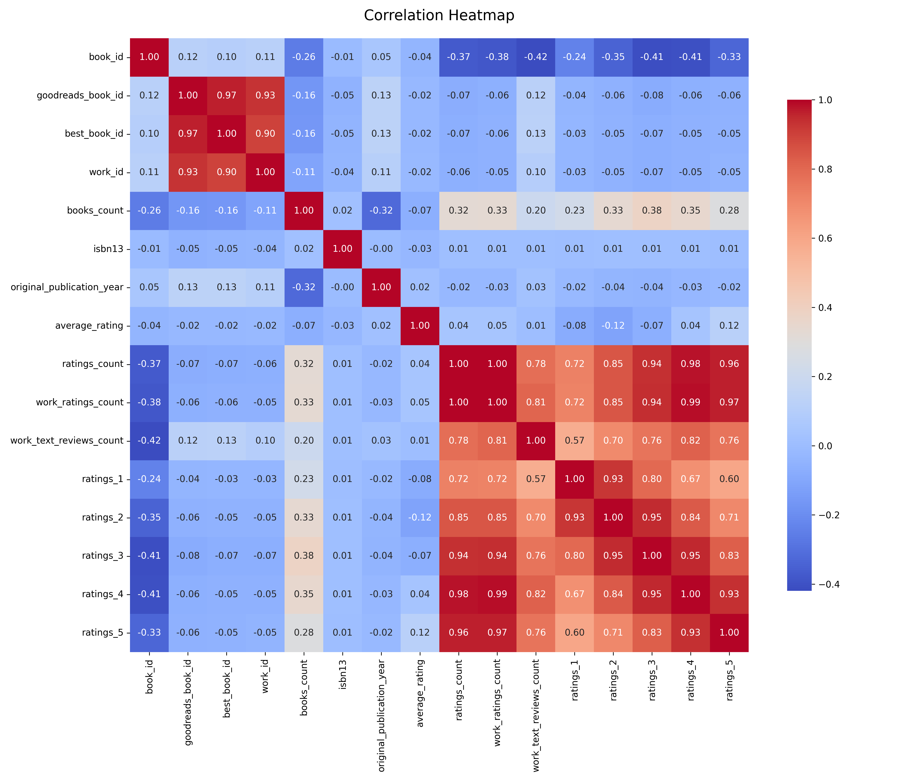
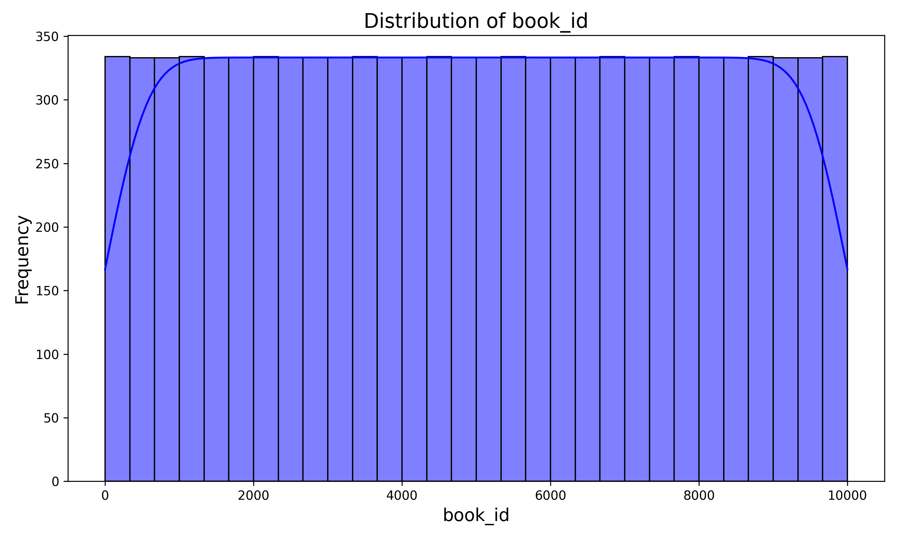
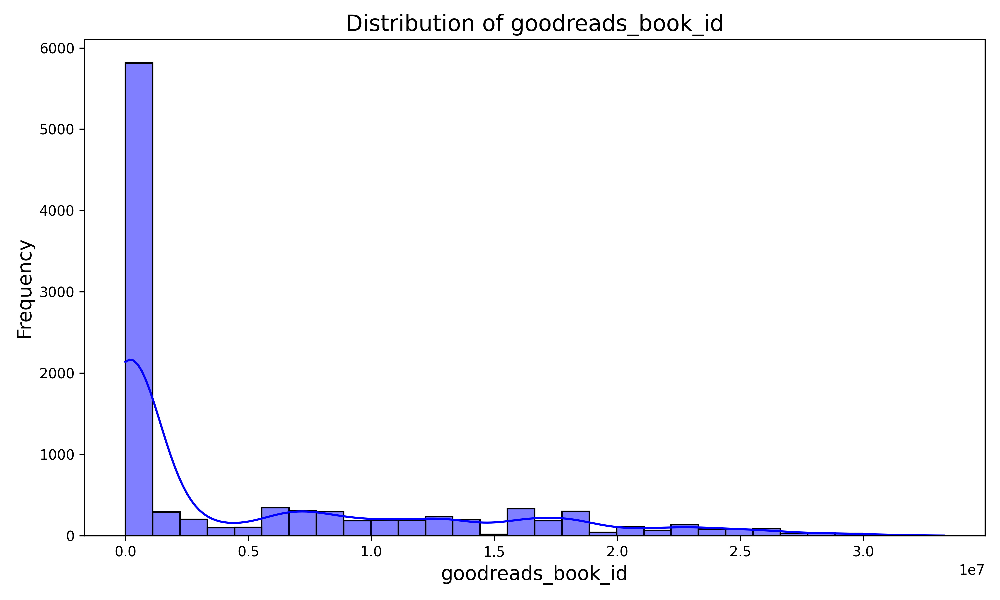
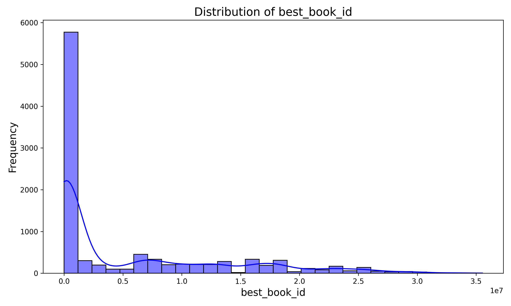
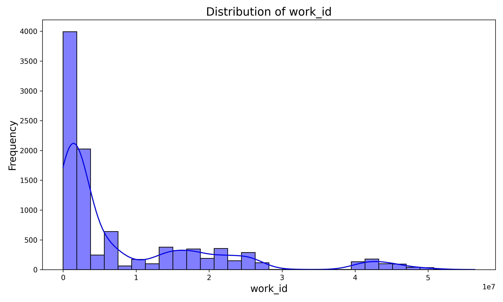
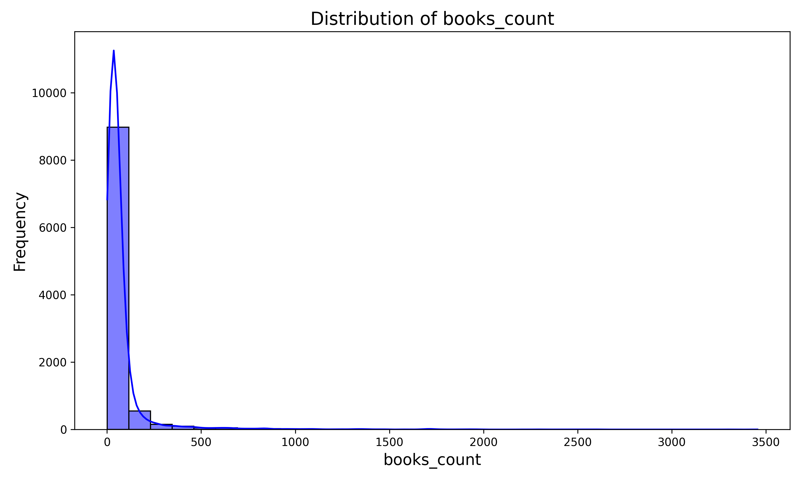
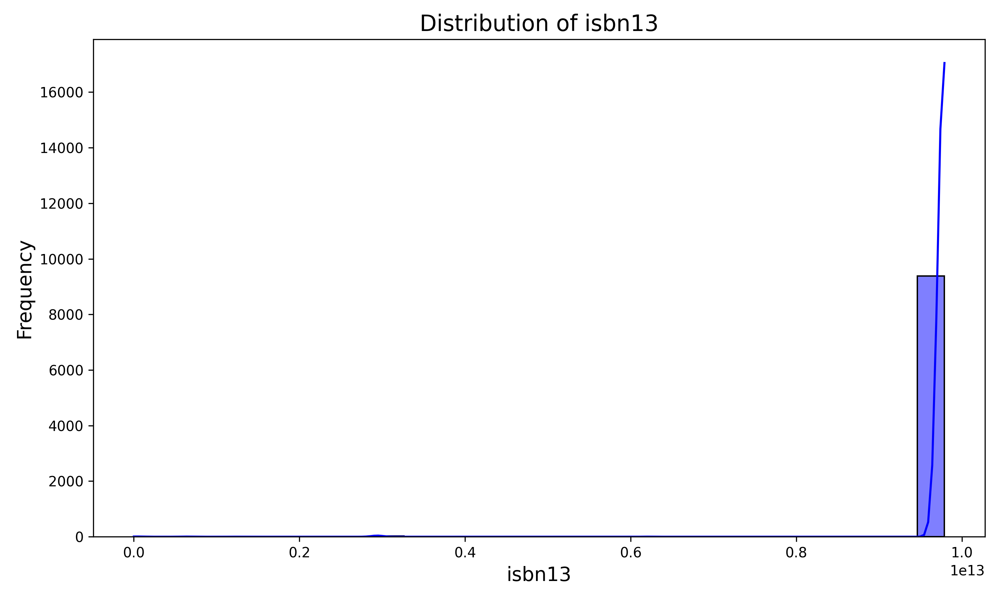
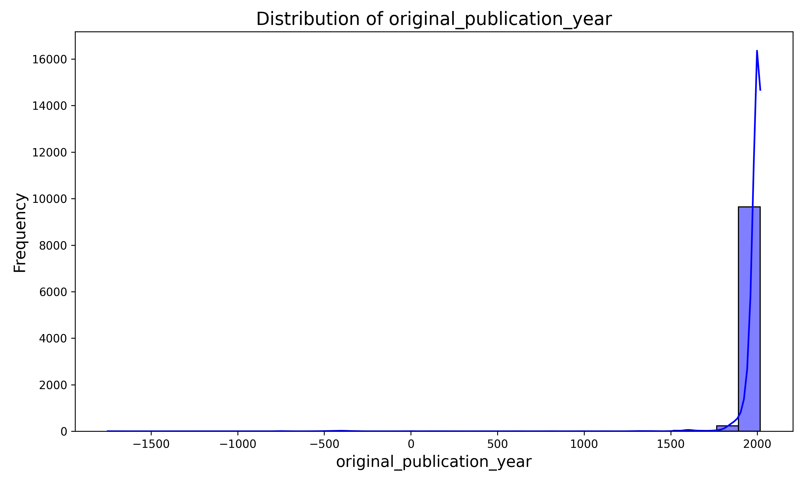
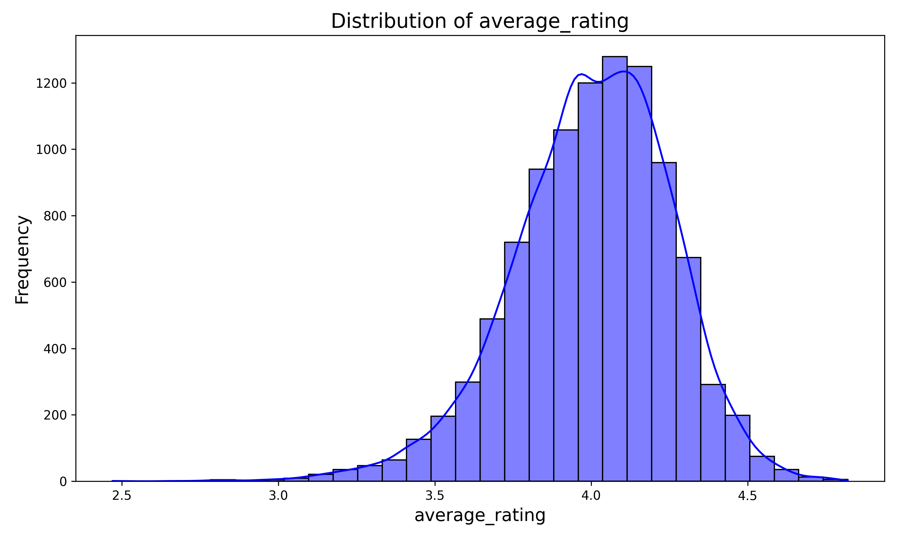
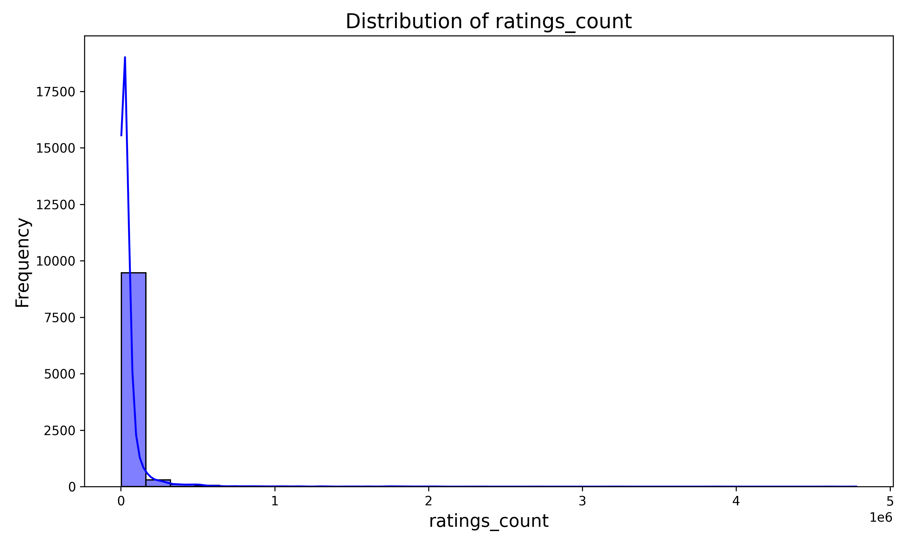
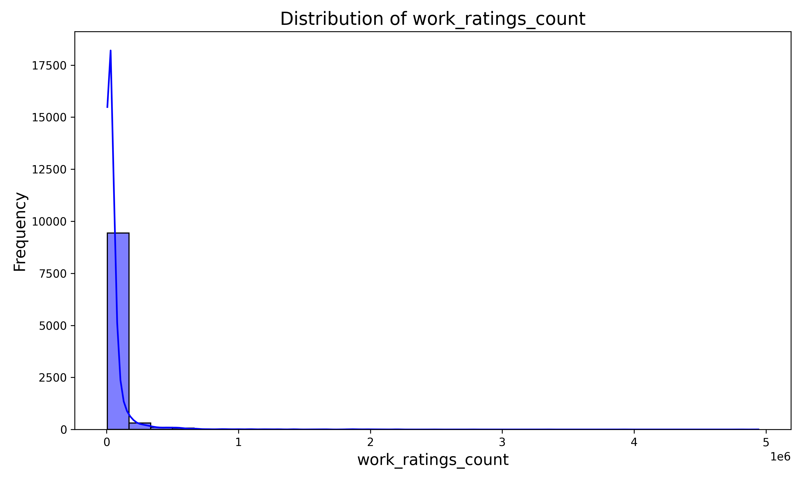
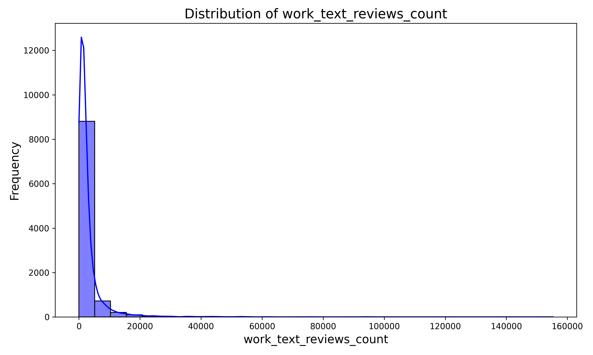
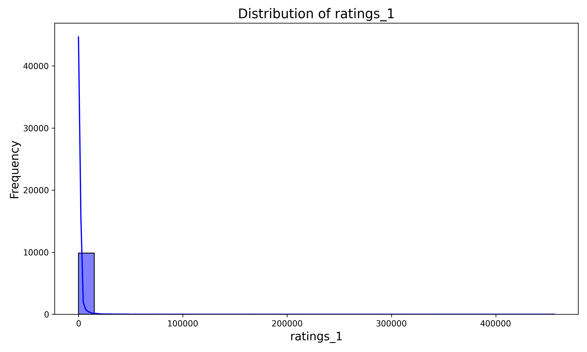
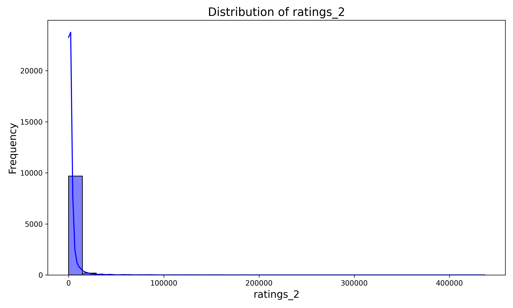
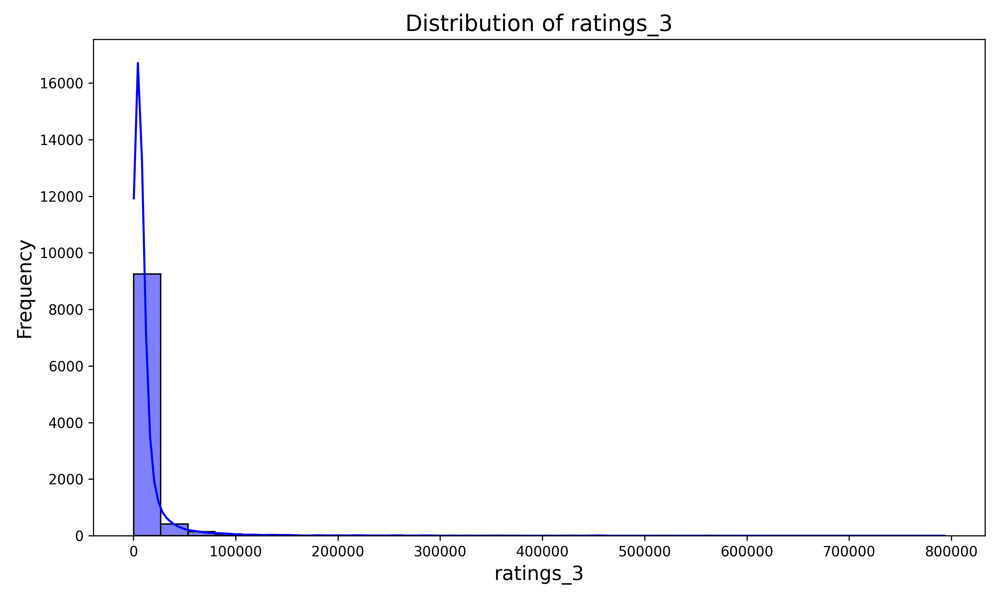
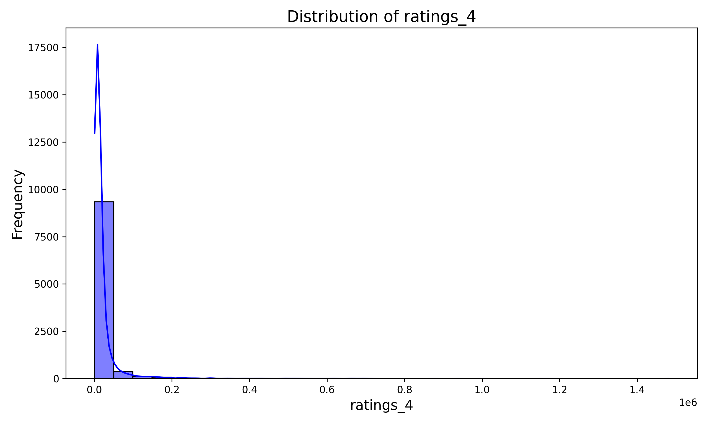
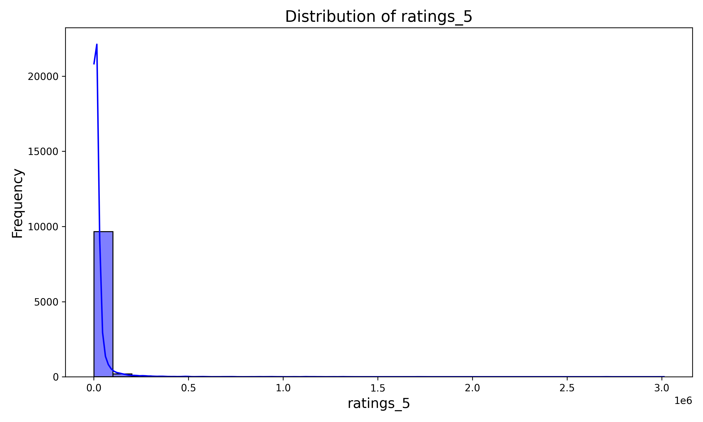
