# Analysis Report

### Summary
The dataset titled `happiness.csv` contains information on happiness metrics across 2363 records and 11 features, including life satisfaction scores, economic indicators, social support, and perceptions of corruption, spanning various countries from 2005 to 2023. 

Key findings from the dataset include:
- **Life Ladder:** The average score is approximately 5.48, indicating a moderate level of reported life satisfaction. 
- **Log GDP per capita:** The average value is around 9.40, reflecting varying economic conditions across countries.
- **Social Support:** The average score is about 0.81, suggesting relatively good levels of perceived social support.
- **Healthy Life Expectancy:** The mean is around 63.40 years, which is a critical indicator of public health.
- **Missing Values:** Several features, notably `Log GDP per capita` (28 missing), `Social support` (13 missing), `Healthy life expectancy` (63 missing), `Freedom to make life choices` (36 missing), `Generosity` (81 missing), `Perceptions of corruption` (125 missing), `Positive affect` (24 missing), and `Negative affect` (16 missing), have significant amounts of missing data, which could impact analysis.

### Recommendations
1. **Address Missing Values:** Consider implementing imputation techniques to handle the missing values in key features to avoid bias in analyses. Techniques such as mean/mode imputation, regression imputation, or more advanced methods like k-nearest neighbors could be applied depending on the feature distribution.

2. **Explore Correlations:** Conduct correlation analysis among the key features, especially between happiness metrics (Life Ladder, Positive and Negative affect) and economic indicators (Log GDP per capita). This may reveal important relationships that could inform policy recommendations.

3. **Time Series Analysis:** Given the temporal nature of the data, performing a time series analysis could help identify trends and changes in happiness metrics over the years. This could be particularly insightful for understanding how global events (like economic crises or pandemics) impact happiness.

4. **Country-Specific Studies:** Since the dataset includes multiple countries, conducting analyses at the country level may provide valuable insights into how local contexts influence happiness. This could involve segmenting the data by region or economic status.

5. **Visualization:** Utilize data visualization techniques to illustrate the distributions and relationships between variables. This could enhance understanding and communication of findings to stakeholders.

6. **Focus on Underrepresented Metrics:** Given the high number of missing values in `Generosity` and `Perceptions of corruption`, further investigation into these areas might be beneficial. Understanding their role in contributing to life satisfaction could inform targeted interventions.

7. **Consider External Factors:** When analyzing the results, consider external factors that may not be captured in the dataset but could influence happiness, such as political stability, cultural differences, and environmental conditions. 

By addressing these recommendations, further analysis can yield deeper insights into the factors affecting happiness and well-being across different countries.

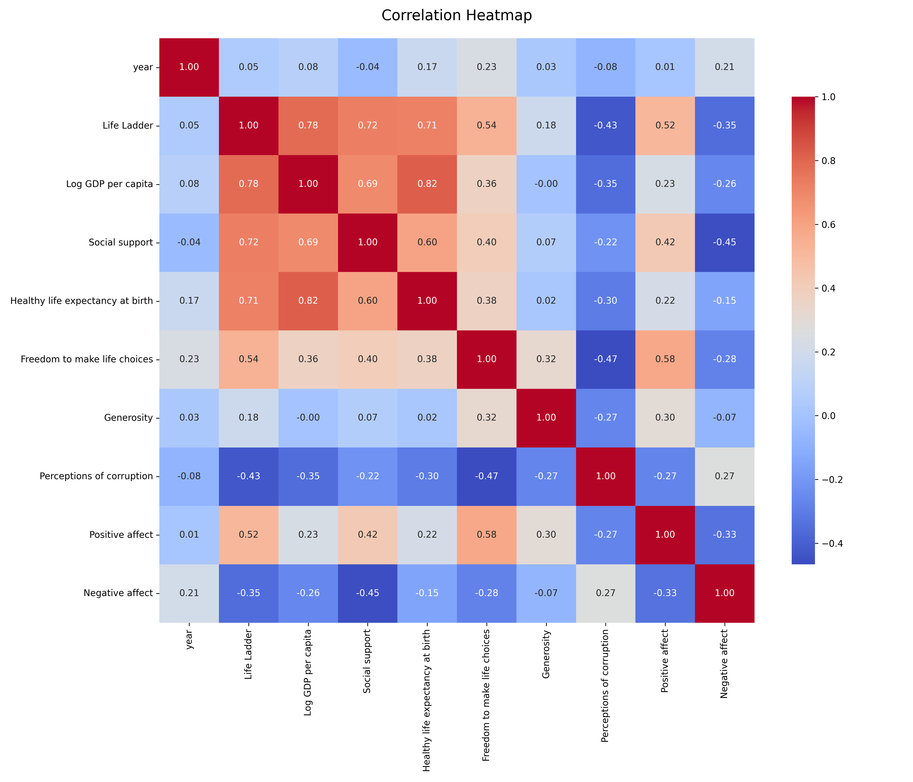
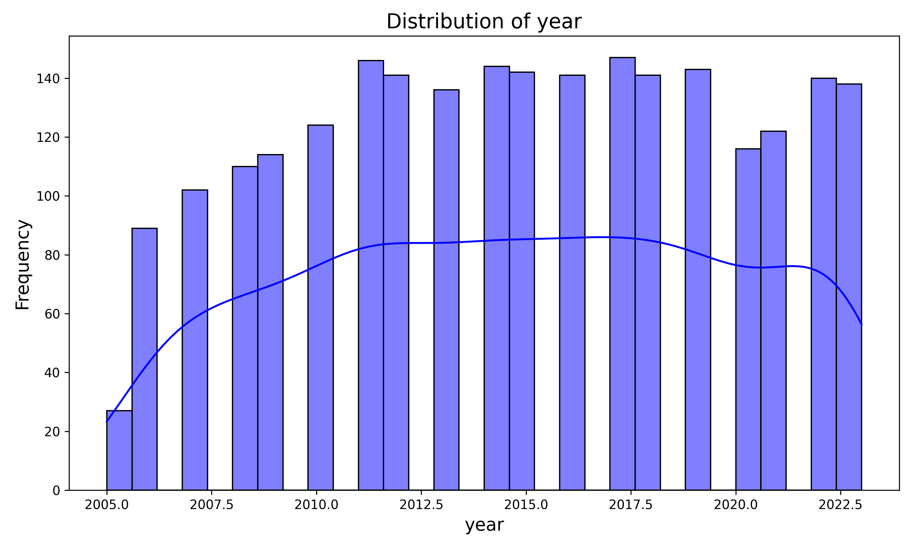
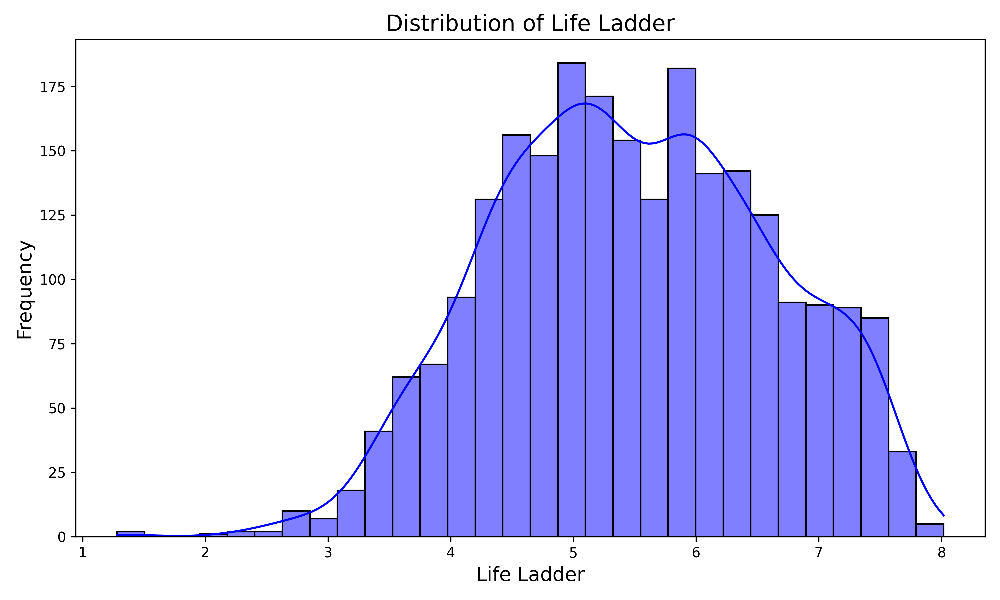
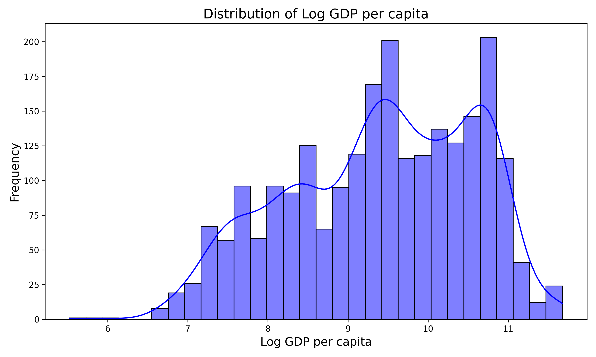
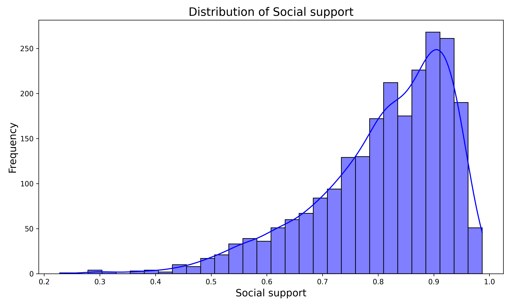
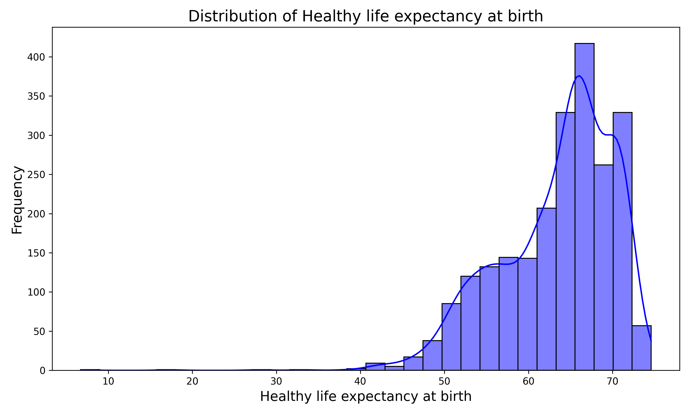
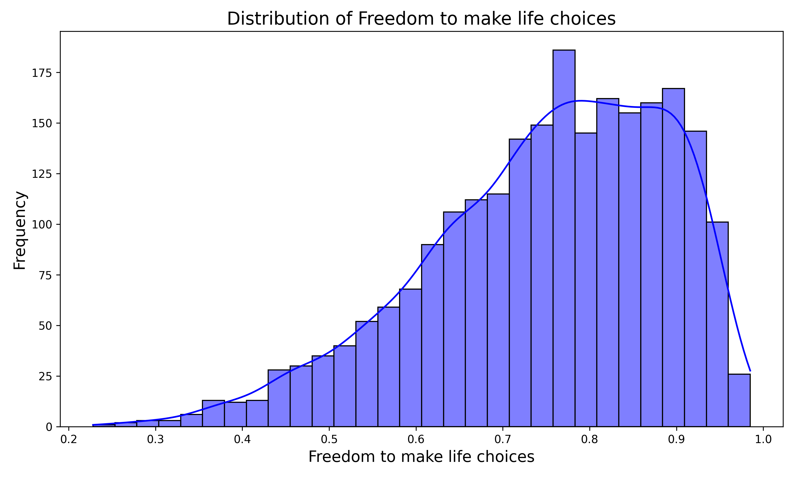
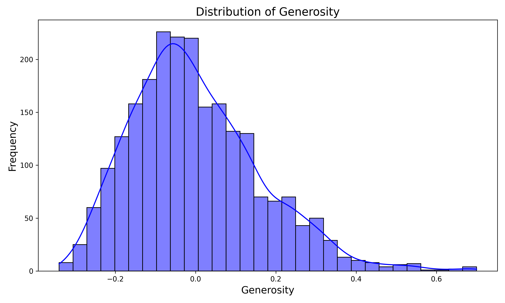
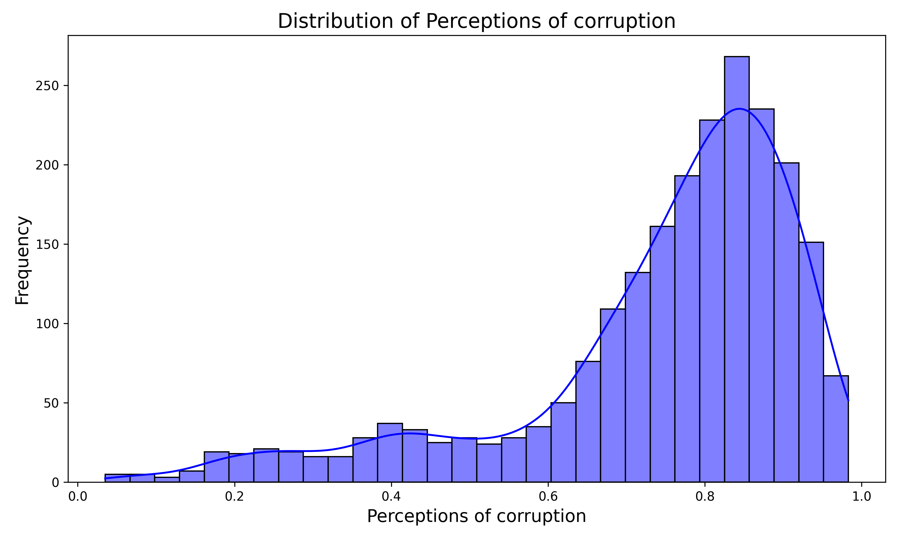
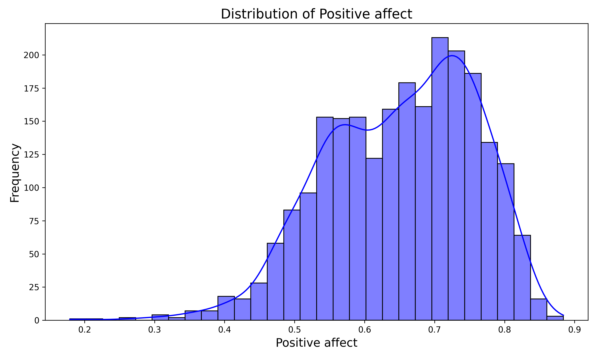
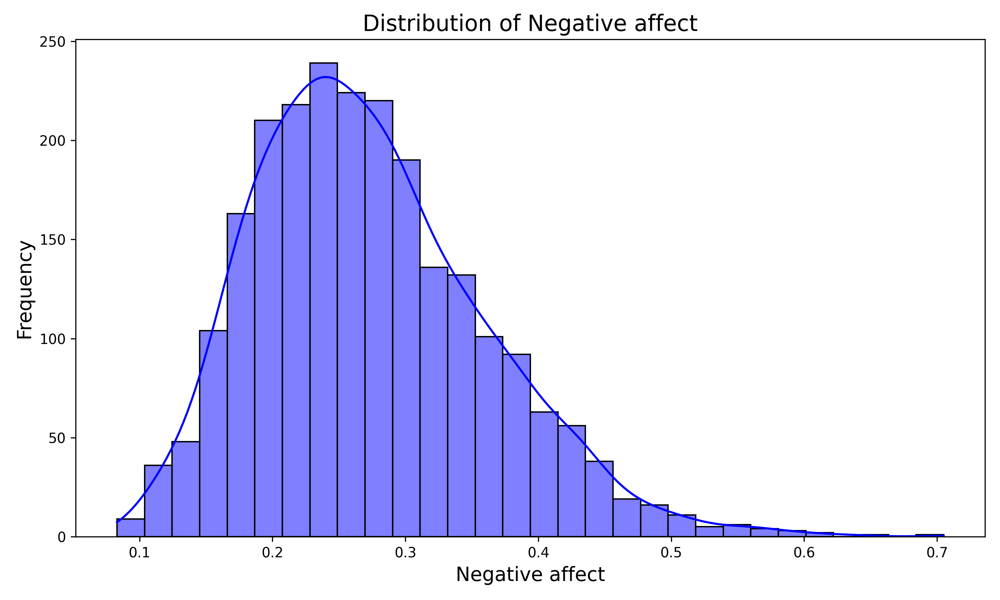
