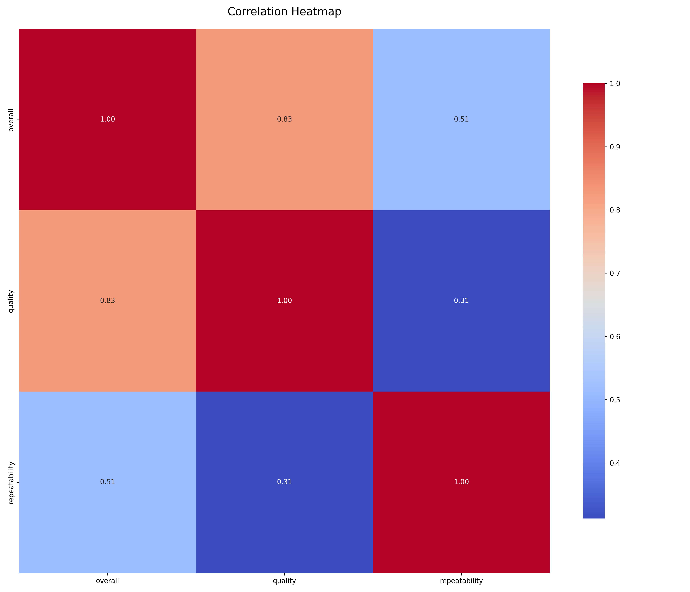
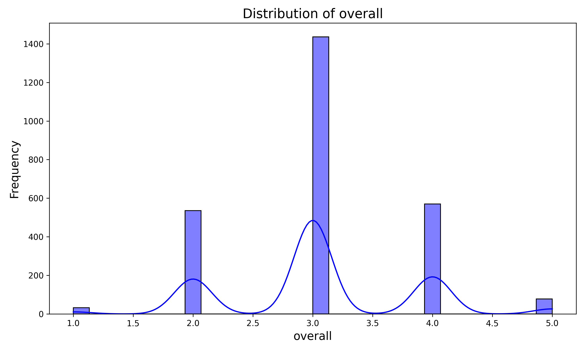
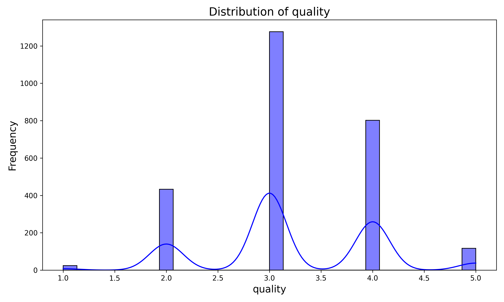
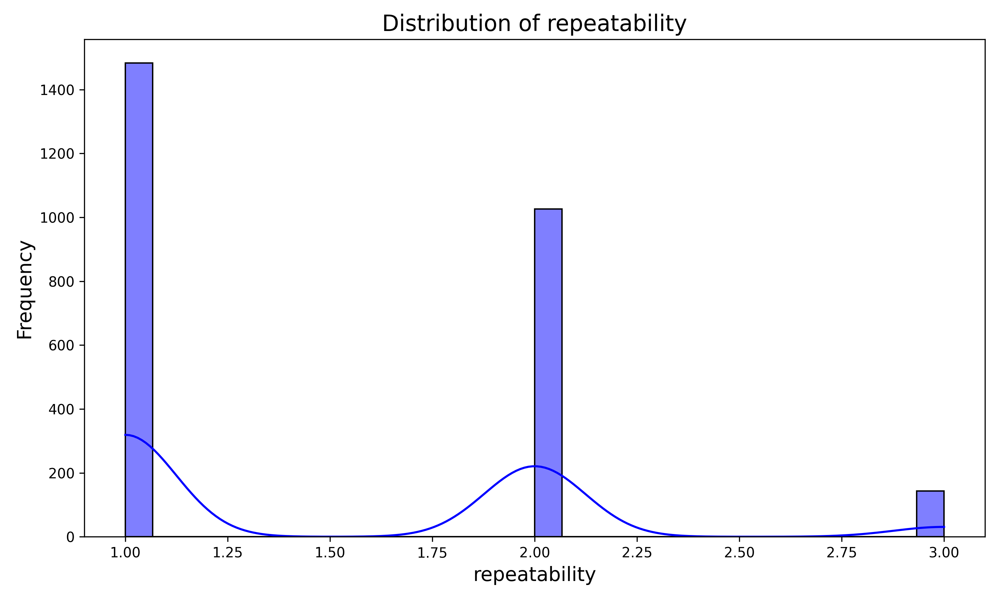

# Analysis Report

### Summary of the Dataset

The dataset, `media.csv`, contains information on 2,652 entries with 8 columns, including details about media content such as date, language, type, title, and various ratings (overall, quality, and repeatability). 

#### Key Findings:
- **Missing Values**: The dataset has 99 missing values in the 'date' column and 262 missing entries in the 'by' column. Other columns do not have missing values.
- **Language**: There are 11 unique languages, with English being the most frequent, appearing in 1,306 instances.
- **Media Type**: There are 8 types of media, predominantly 'movie', which accounts for 2,211 entries.
- **Titles**: A total of 2,312 unique titles are present, with 'Kanda Naal Mudhal' being the most frequently mentioned title (9 occurrences).
- **Ratings**:
  - The average overall rating is approximately 3.05, with a standard deviation of 0.76, indicating a moderate to high level of satisfaction.
  - The average quality rating is around 3.21, suggesting similar satisfaction levels for media quality.
  - The repeatability rating averages 1.49, which indicates that many entries are not highly repeatable or rewatchable.

### Recommendations:

1. **Address Missing Values**:
   - Investigate the missing 'date' and 'by' columns. If feasible, impute the missing values using appropriate methods or remove entries that are critically impacted.
   - Consider retaining only complete records for analysis if the missing data cannot be reliably filled.

2. **Enhance Data Quality**:
   - Standardize the 'date' format to ensure consistency for any time-based analysis.
   - Normalize the 'by' column names to eliminate duplicates or variations that may confuse analysis.

3. **Explore Content Types**:
   - Given the predominance of 'movies', consider breaking down the dataset further by type for targeted analysis, which could reveal insights into viewer preferences or trends.

4. **Deepen Analysis of Ratings**:
   - Conduct further analysis on the distribution of ratings to identify any skewness or trends. This may involve segmenting by language or media type to uncover specific insights.
   - Investigate the correlation between the overall rating, quality, and repeatability to understand how these factors influence each other.

5. **Consider User Engagement**:
   - If possible, gather additional data on user engagement, such as views or user comments, which could provide a richer context for understanding satisfaction and repeatability.

By implementing these recommendations, the dataset can be better utilized for analysis and insights into media consumption trends and preferences.

